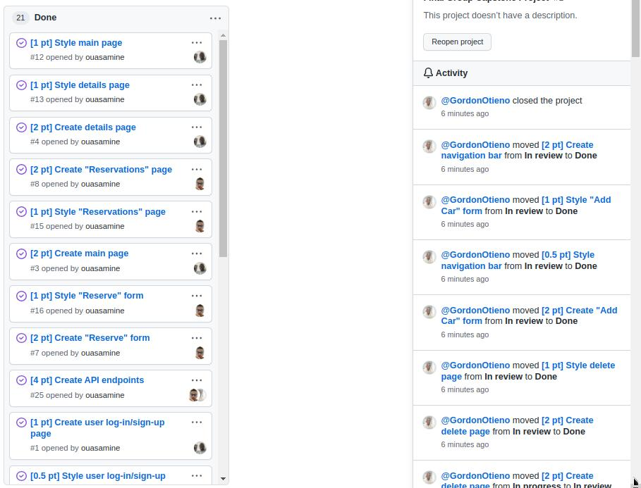

<!-- TABLE OF CONTENTS -->

# 📗 Table of Contents

- [📖 About the Project](#about-project)
  - [🛠 Built With](#built-with)
    - [Tech Stack](#tech-stack)
    - [Key Features](#key-features)
  - [🚀 Live Demo](#live-demo)
- [💻 Getting Started](#getting-started)
  - [Setup](#setup)
  - [Prerequisites](#prerequisites)
  - [Install](#install)
  - [Usage](#usage)
  - [Run tests](#run-tests)
  - [Deployment](#triangular_flag_on_post-deployment)
- [👥 Author](#author)ru
- [🤝 Contributing](#contributing)
- [⭐️ Show your support](#support)
- [🙏 Acknowledgements](#acknowledgements)
- [📝 License](#license)

<!-- PROJECT DESCRIPTION -->

# 📖 Capstone - i-model-cars 

**Ruby on Rails**

> i-model-cars app helps `users` to book/make a reservation for latest model cars. It allows user to log in with `username` and `e-mail` and then reserve, add/create and delete cars. It is built on Rails API with React using `Rubygem` and `npm` as software packages system.

## 🛠 Built With 

> `Ruby 3.1.3` > `postgresql` > `Rails 7` > `React`

### Kanban board

[Link to kanban board](https://github.com/GordonOtieno/i-model-cars-backend/projects/1#column-19368376)
> Team members: 3

### Tech Stack 

Backend/Frontend

  <ul>
    <li><a href="https://www.rubyonrails.org/">Rails</a></li>
    <li><a href="https://www.react.org/">Rails</a></li>
  </ul>

<!-- Features -->

### Key Features 

- **Car Models**
- **Reservations**
- **API**

(<a href="#readme-top">back to top</a>)

<!-- LIVE DEMO -->

## 🚀 Live Demo 

- [Live Link](https://i-model-cars.onrender.com/api/v1)
- [Link to frontend repo.](https://github.com/GordonOtieno/i-model-cars-frontend)
- [Link to API documentation](https://i-model-cars.onrender.com/api-docs/index.html)

(<a href="#readme-top">back to top</a>)

<!-- GETTING STARTED -->

## 💻 Getting Started 

> To get a local copy up and running, follow these steps.

### Prerequisites

In order to run this project you need:

- A Desktop or Laptop Computer running on with Windows, Mac OS or Linux operating system.
- Rails installed on the Computer

### Setup

Clone these repositories to your desired folder:

- `https://github.com/GordonOtieno/i-model-cars-backend.git` and 
- `https://github.com/GordonOtieno/i-model-cars-frontend.git` if you prefer ssh and hit enter.
- create a directory in your preferred location (e.g in the Desktop or Document directory)

  ### Setup Database

  To setup database locally run the following command:

  - `rails db:create` to create database locally.
  - `rails db:migrate` to create migration files.
  - `rails db:seed` to add initial data to db.

### Install

Install this project with:

- Install Ruby on Rails framework.
- Use RubyGems as a software package system.
- Dependencies _(a packet manager is required)_: then you run the command `bundle install` in the terminal

### Usage

To run the project, execute the following command:

- `rails server`
- This will run the project in the terminal in the specified directory

### Run tests

To run tests, run the following command:

- `rspec spec`
- This will run all tests on your local machine

(<a href="#readme-top">back to top</a>)

<!-- AUTHORS -->

## 👥 Authors 

👤 **Okechukwu Muokwugwo**

- GitHub: [@githubhandle](https://github.com/Okechukwu-muokwugwo)
- Twitter: [@twitterhandle](https://twitter.com/excel4eva)
- LinkedIn: [LinkedIn](LinkedIn.com/in/okeimuokwugwo)

👤 **Gordon Otieno**

- GitHub: [@GordonOtieno](https://github.com/GordonOtieno)
- Twitter: [@GordonOtieno](https://twitter.com/GordonO34459259/twitterhandle)
- LinkedIn: [GordonOtieno](https://www.linkedin.com/in/gordonotieno/)

👤 **Amine**

- GitHub: [@ouasamine](https://github.com/ouasamine)
- Twitter: [@ouass_amine](https://twitter.com/ouass_amine)
- LinkedIn: [LinkedIn](https://www.linkedin.com/in/amine-ouassef)

(<a href="#readme-top">back to top</a>)

<!-- CONTRIBUTING -->

## 🤝 Contributing 

Contributions, issues, and feature requests are welcome!

Feel free to check the [issues page](../../issues/).

(<a href="#readme-top">back to top</a>)

<!-- SUPPORT -->

## ⭐️ Show your support 

> If you like this project then kindly give me a star ⭐️ in the project repository.

(<a href="#readme-top">back to top</a>)

<!-- ACKNOWLEDGEMENTS -->

## 🙏 Acknowledgments & Attribution 

- I would like to thank *Gregoire Vella on Behance*
- Hat tip to anyone whose code was used.
- Inspiration, etc.

(<a href="#readme-top">back to top</a>)

<!-- LICENSE -->

## 📝 License 

This project is [MIT](./MIT.md) licensed.

(<a href="#readme-top">back to top</a>)
